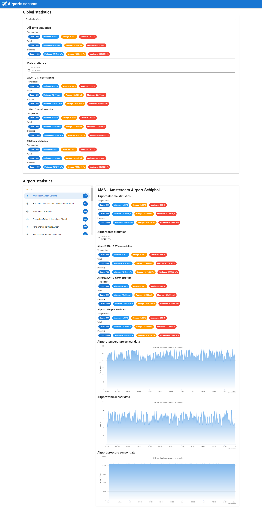

# Airport sensors

A training project using:
 - Golang
 - Redis
 - MQTT
 - Vue.js, Vuetify
 - Highcharts

Timeline:
1. Golang fake airport sensors periodically send data using MQTT.
1. A Golang MQTT listener saves this data in CSV files.
1. A Golang MQTT listener saves this data in a Redis database, and computes lots of statistics, by day, month and year.
1. A Golang REST API serves this data.
1. A Vue.js SPA consumes this REST API, showing some Highcharts graphs.

## Project architecture


## Screenshot



## Install

Download dependencies

```
go get ./...
```

## Run

Available binaries:

 - `fakeiot`
 - `mqttfile`
 - `mqttredis`
 - `restapi`

```
go run cmd/<binary>/main.go
```

Start Mosquitto broker (port **18830**)

```
./scripts/startMosquittoBroker.sh
# or
docker run -it -p 18830:1883 -p 9001:9001 eclipse-mosquitto
```

Start Redis

```
./scripts/startRedis.sh
# or
docker run -it -p 6379:6379 redis
# or
redis-server
```

## Front-end

See [Front README](./front/README.md).

## API routes

```
http://localhost:8080/airports

http://localhost:8080/airports/ATL/date/2020-10-06/sensors/pressure
http://localhost:8080/airports/ATL/date/2020-10-06/sensors/temperature
http://localhost:8080/airports/ATL/date/2020-10-06/sensors/wind

http://localhost:8080/airports/CDG/dateStats/2020-10-06
http://localhost:8080/airports/CDG/dateStats/2020-10
http://localhost:8080/airports/CDG/dateStats/2020
http://localhost:8080/airports/CDG/dateStats/total

http://localhost:8080/dateStats/2020-10-06
http://localhost:8080/dateStats/2020-10
http://localhost:8080/dateStats/2020
http://localhost:8080/dateStats/total
```

## Some Redis keys

```
sensor|2020-09-30|ORD|count 222
sensor|2020-09-30|ORD|pressure|avg 1051.3913544687514
sensor|2020-09-30|ORD|pressure|count 37
sensor|2020-09-30|ORD|pressure|data ,{"v":1050.311188,"d":"2020-09-30 23:33:54 +0200 CEST"},{"v":1049.996706,"d":"2020-09-30 23:34:04 +0200 CEST"}
sensor|2020-09-30|ORD|pressure|max 1052.878002
sensor|2020-09-30|ORD|pressure|min 1048.08587
sensor|2020-09-30|ORD|temperature|avg 23.52497999857995
sensor|2020-09-30|ORD|temperature|count 37
sensor|2020-09-30|ORD|temperature|data ,{"v":23.331977,"d":"2020-09-30 23:33:54 +0200 CEST"},{"v":20.497356,"d":"2020-09-30 23:34:04 +0200 CEST"}
sensor|2020-09-30|ORD|temperature|max 27.907284
sensor|2020-09-30|ORD|temperature|min 19.006259
sensor|2020-09-30|ORD|wind|avg 5.989501117821749
sensor|2020-09-30|ORD|wind|count 37
sensor|2020-09-30|ORD|wind|data ,{"v":6.823899,"d":"2020-09-30 23:33:54 +0200 CEST"},{"v":5.929727,"d":"2020-09-30 23:34:04 +0200 CEST"}
sensor|2020-09-30|ORD|wind|max 7.75502
sensor|2020-09-30|ORD|wind|min 4.004205
sensor|2020-09|ORD|count 111
sensor|2020-09|ORD|pressure|avg 1051.3913544687514
sensor|2020-09|ORD|pressure|count 37
sensor|2020-09|ORD|pressure|max 1052.878002
sensor|2020-09|ORD|pressure|min 1048.08587
sensor|2020-09|ORD|temperature|avg 23.52497999857995
sensor|2020-09|ORD|temperature|count 37
sensor|2020-09|ORD|temperature|max 27.907284
sensor|2020-09|ORD|temperature|min 19.006259
sensor|2020-09|ORD|wind|avg 5.989501117821749
sensor|2020-09|ORD|wind|count 37
sensor|2020-09|ORD|wind|max 7.75502
sensor|2020-09|ORD|wind|min 4.004205
sensor|2020|ORD|count 111
sensor|2020|ORD|pressure|avg 1051.3913544687514
sensor|2020|ORD|pressure|count 37
sensor|2020|ORD|pressure|max 1052.878002
sensor|2020|ORD|pressure|min 1048.08587
sensor|2020|ORD|temperature|avg 23.52497999857995
sensor|2020|ORD|temperature|count 37
sensor|2020|ORD|temperature|max 27.907284
sensor|2020|ORD|temperature|min 19.006259
sensor|2020|ORD|wind|avg 5.989501117821749
sensor|2020|ORD|wind|count 37
sensor|2020|ORD|wind|max 7.75502
sensor|2020|ORD|wind|min 4.004205
sensor|total|ORD|pressure|avg 1051.3913544687514
sensor|total|ORD|pressure|count 37
sensor|total|ORD|pressure|max 1052.878002
sensor|total|ORD|pressure|min 1048.08587
sensor|total|ORD|temperature|avg 23.52497999857995
sensor|total|ORD|temperature|count 37
sensor|total|ORD|temperature|max 27.907284
sensor|total|ORD|temperature|min 19.006259
sensor|total|ORD|wind|avg 5.989501117821749
sensor|total|ORD|wind|count 37
sensor|total|ORD|wind|max 7.75502
sensor|total|ORD|wind|min 4.004205
```

## License

```
           DO WHAT THE FUCK YOU WANT TO PUBLIC LICENSE
                   Version 2, December 2004
 
Copyright (C) 2004 Sam Hocevar <sam@hocevar.net>

Everyone is permitted to copy and distribute verbatim or modified
copies of this license document, and changing it is allowed as long
as the name is changed.
 
           DO WHAT THE FUCK YOU WANT TO PUBLIC LICENSE
  TERMS AND CONDITIONS FOR COPYING, DISTRIBUTION AND MODIFICATION

 0. You just DO WHAT THE FUCK YOU WANT TO.
 ```
